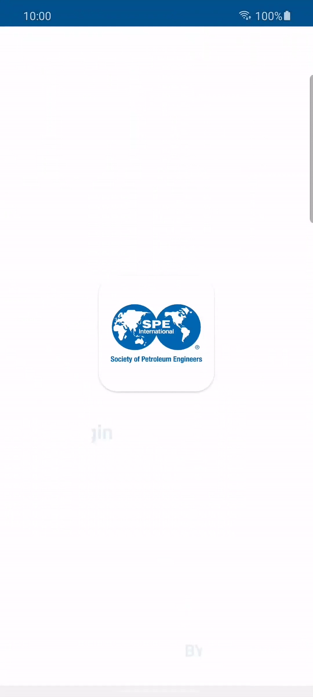
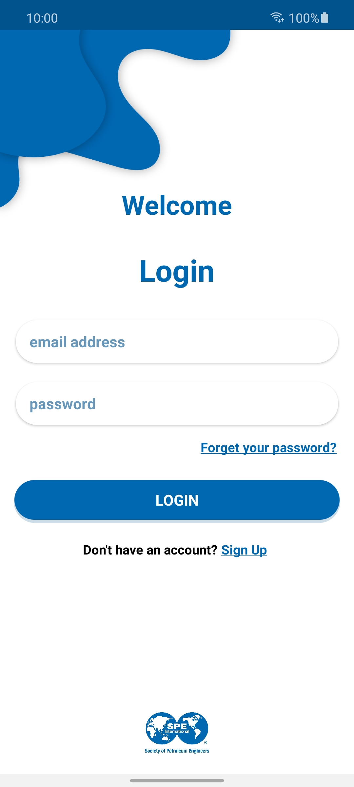
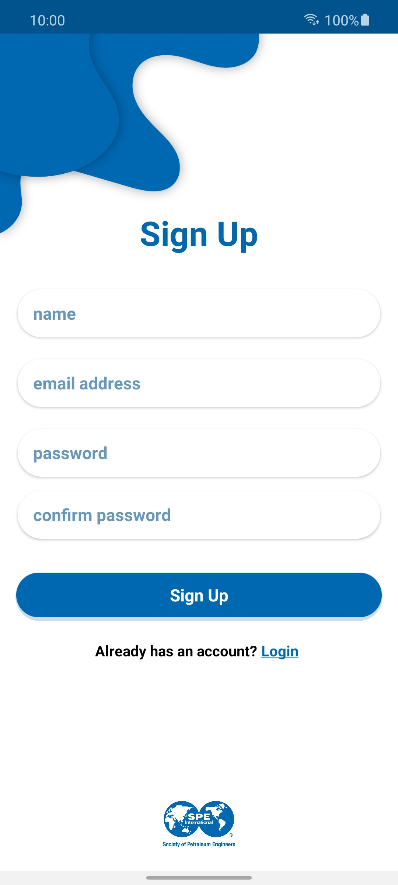
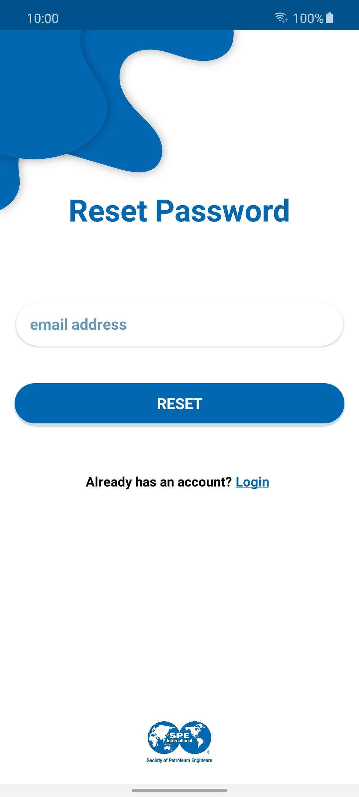
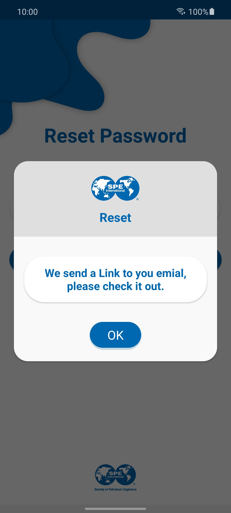

# SpeLogin

- A demo app for login / sign up / reset password screens with a beautiful design linked with the Firebase.

# Screenshots

  
  
  
  
  

# Usage

**Step 1**

1- Download the project.

2- Create a new project in Firebase.

2- Download and add your {google-services.json} file to the project in that path "SpeLogin/app/".

3- Activate the authentication feature and enable the "Email/Password" method provider.

4- Activate the Realtime-Database (to save the user data like his name etc...).

5- Import the project to Android Studio or any IDEs you prefer and enjoy with your app.

# Apk
Download and test the app on your device from [here](https://raw.githubusercontent.com/m-tharwat262/SpeLogin/master/Apk/Application.apk)
